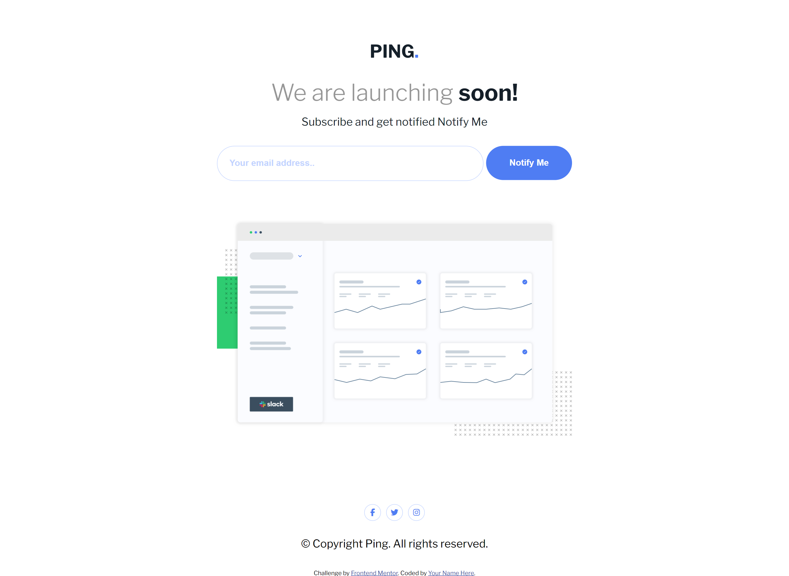

# Frontend Mentor - Ping coming soon page solution

This is a solution to the [Ping coming soon page challenge on Frontend Mentor](https://www.frontendmentor.io/challenges/ping-single-column-coming-soon-page-5cadd051fec04111f7b848da). Frontend Mentor challenges help you improve your coding skills by building realistic projects.

## Table of contents

- [Overview](#overview)
  - [The challenge](#the-challenge)
  - [Screenshot](#screenshot)
  - [Links](#links)
- [My process](#my-process)
  - [Built with](#built-with)
  - [What I learned](#what-i-learned)
  - [Continued development](#continued-development)
  - [Useful resources](#useful-resources)
- [Author](#author)

## Overview

### The challenge

Users should be able to:

- View the optimal layout for the site depending on their device's screen size
- See hover states for all interactive elements on the page
- Submit their email address using an `input` field
- Receive an error message when the `form` is submitted if:
  - The `input` field is empty. The message for this error should say _"Whoops! It looks like you forgot to add your email"_
  - The email address is not formatted correctly (i.e. a correct email address should have this structure: `name@host.tld`). The message for this error should say _"Please provide a valid email address"_

### Screenshot

### Links

- Solution [Add solution URL here]
- Live Site [Add live site URL here]

## My process

### Built with

- Semantic HTML5 markup
- CSS custom properties
- Flexbox
- Mobile-first workflow

### What I learned

Had a lot of fun breaking down the steps when testing the email matched the desired format. Once I had the challenge figured out, visually representing it was next. It was fun tying in each "error" visually. Ultimately I just enjoyed seeing it come to life. Another thing, I also figured it be a nice point in my journey to utilize scss more, so I did that.
In no way I plan to know it all by heart I'll be leaving helpful links below.

### Continued development

I'd like to continue using tools that will help in the future such as more SCSS and all I have to learn of it. A well as more languages and frameworks.
Another thing simply better implementation of JS I think I do fine but I know I can always aim for better.

### Useful resources

- [Email Validator Regex](https://emaillistvalidation.com/blog/email-validation-in-javascript-using-regular-expressions-the-ultimate-guide/#:~:text=A%20common%20and%20widely%20accepted,Z%5D%7B2%2C4%7D%24%2F%20.)
- [Space Validator Regex](https://www.geeksforgeeks.org/how-to-remove-spaces-from-a-string-using-javascript/)

- [Font Awesome - Social Icons ](https://fontawesome.com)

**Note: Delete this note and replace the list above with resources that helped you during the challenge. These could come in handy for anyone viewing your solution or for yourself when you look back on this project in the future.**

## Author

- Frontend Mentor - [@moncadad](https://www.frontendmentor.io/profile/moncadad)
